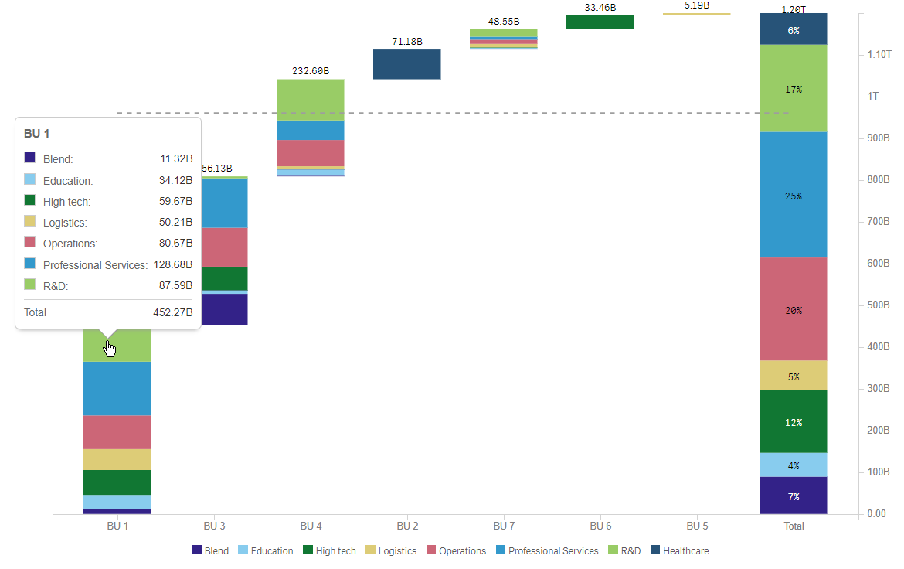
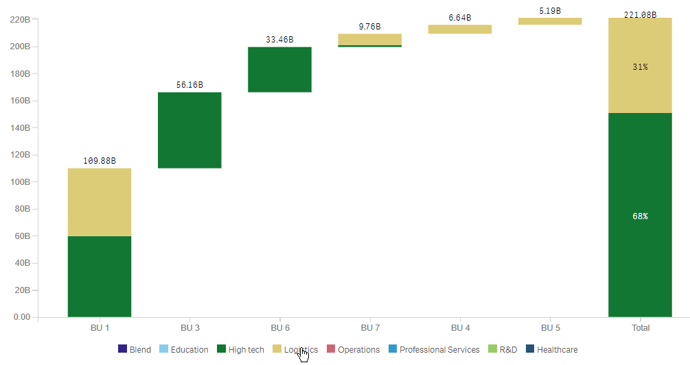
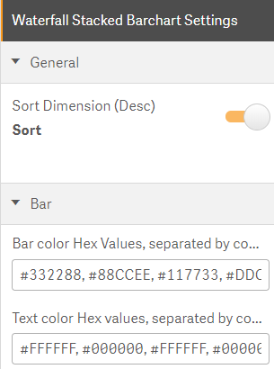

 

# SenseUI-Waterfall-Stacked-Barchart

- A waterfall Stacked barchart with the option of sorting by either the first dimension or the total value of the stacked bars which mimics a Pareto look and feel

### Installation
- `npm install`
- `npm start`

### Usage

#### Configure
- Add the 1st Dimension for the x-axis
- Add the 2nd Dimension for the stacked bars on the y-axis
- Add the measure for the financial analysis

#### Features
- Tooltip with all of the Dimensions, their colors and their values, with a total
- X-axis labels are clickable and select 1st dimension
- Legend items are clickable and select 2nd dimension
-  

#### Settings   
- Sort Dimension (Desc), for a Pareto look and feel without the line
- Bar color Hex Values, separated by comma
- Text color Hex values, separated by comma
-  
